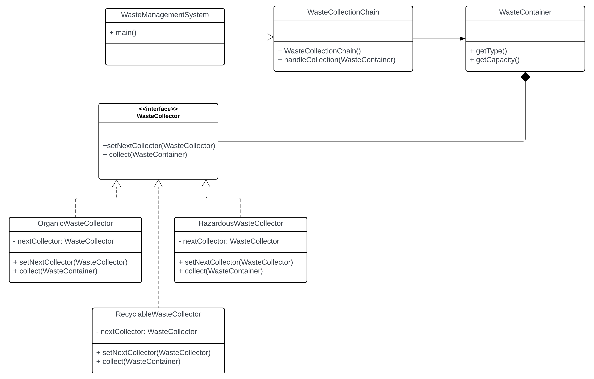

# Lab-Assignment-3-Chain-of-Responsibility

<h3>Automated Waste Management System</h3>

Background: 

    Municipalities and cities face significant challenges in managing and efficiently disposing of waste. Traditional waste collection methods often result in delays, inefficiencies, and high operational costs. An innovative solution is needed to automate the waste management process, ensuring timely collection and disposal while optimizing resource utilization.

Objective: 

    Develop an automated waste management system that uses a chain of responsibility pattern to ensure efficient waste collection and disposal. The system should handle different types of waste containers and trigger appropriate disposal actions based on the type and capacity of each container.

Requirements:

    Waste Container: 
    
        Create a class to represent waste containers, each with a specific capacity and type of waste (e.g., organic, recyclable, hazardous).

    Waste Collection Chain: 
    
        Implement a chain of responsibility pattern to handle different types of waste containers. Each handler in the chain should be responsible for collecting and disposing of a specific type of waste.

    Waste Collection Process:

        The system should initialize a chain of waste collectors, each responsible for a different type of waste.
    When a waste container is full or needs disposal, the system should trigger the waste collection process.
    The appropriate waste collector in the chain should handle the disposal based on the type and capacity of the waste container.

Validation: 

    Ensure that waste containers are correctly identified and disposed of by the appropriate waste collector in the chain.

UML Diagram:

